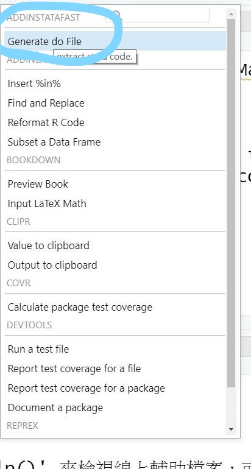

RStudio Addins for StataMarkdown
==============
This is a helper for extract stata code from StataMarkdown RMD file.

- purpose
  To test long stata code in rmd file takes a long time. Therefor,this add in is used to extract all stata code and then debug in stata.
  

- install

library("devtools")  
devtools::install_github("airbone4/StataMdAid")  

- usage

